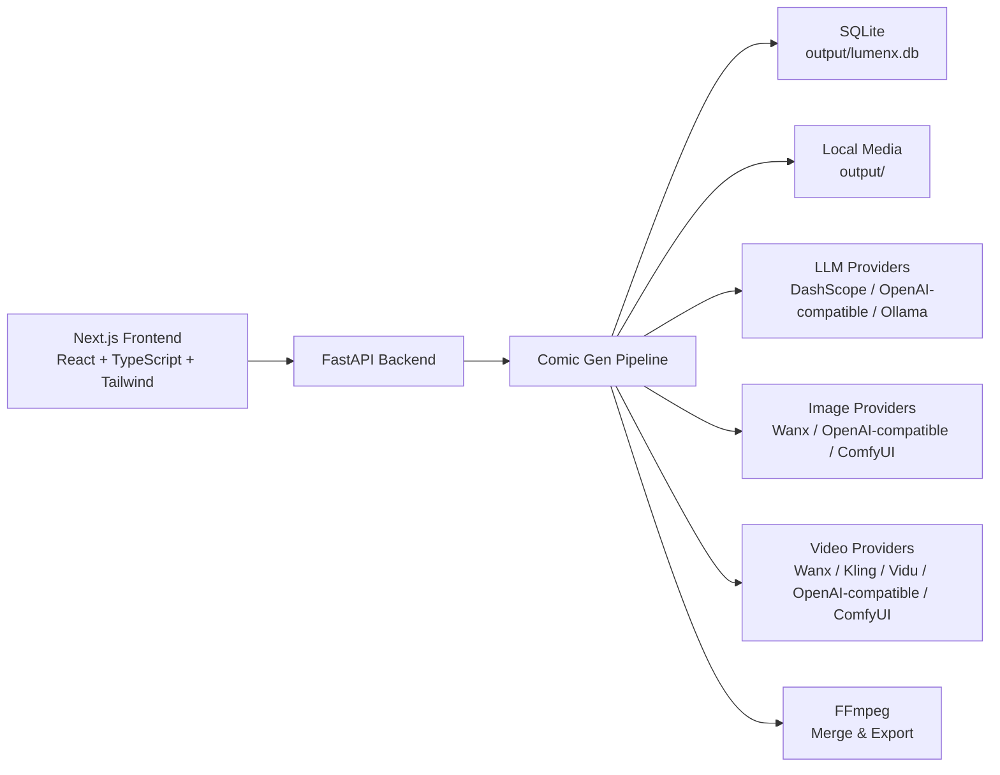

<div align="center">
  
</div>

<div align="center">

# LumenX Studio

AI 原生短漫剧创作平台  
**Render Noise into Narrative**

[](LICENSE)
[](https://www.python.org/)
[](https://nodejs.org/)

[English](README_EN.md) | [用户手册](USER_MANUAL.md) | [贡献指南](CONTRIBUTING.md)

</div>

---

## 项目定位

LumenX Studio 是一个面向短漫剧、AI 短片和系列化视觉内容的本地优先创作平台。它把小说或剧本文本转化为结构化创作工程，并串起实体提取、风格定调、资产生成、分镜制作、视频生成和成片拼接。

当前版本重点支持两类生产方式：

- **I2V Legacy**：传统首帧图生视频流程，适合逐镜头精细控制。
- **R2V / Series 工作流**：围绕系列资产复用，以角色、场景、道具参考图驱动分镜视频生成，适合批量化短剧生产。

---

## 当前能力

### 1. 剧本与实体

- 剧本编辑与重解析
- LLM 自动提取角色、场景、道具
- 支持手动修正实体类型、描述、出场关系
- 支持 Series 维度共享资产，跨集复用角色、场景、道具

### 2. 风格定调

- 项目级 / 系列级 Art Direction
- 正向、负向提示词统一管理
- 可为后续图像和视频生成注入统一视觉标准

### 3. 资产生成

- 角色、场景、道具图片生成
- 角色支持全身图、三视图、头像等资产形态
- 支持候选图、多批次生成、选中变体、上传参考图
- Series 共享资产可在主体库、角色页、CAST 页面中复用

### 4. 分镜与视频

- 分镜脚本生成与编辑
- 分镜图生成
- I2V：基于首帧图片生成视频
- R2V：基于角色、场景、道具参考素材生成视频
- 视频候选管理、标星、标签、重试

### 5. 成片与调试

- 分镜视频选择与拼接
- Request Log 请求日志
- SQLite 本地项目数据
- 本地 `output/` 媒体文件存储，可选 OSS 镜像

---

## 系统架构



### 主要目录

```text
lumenx/
├── frontend/                 # Next.js 前端
├── src/apps/comic_gen/       # 剧本、系列、资产、分镜、任务编排
├── src/models/               # 图像、视频、LLM provider adapter
├── src/utils/                # SQLite、日志、存储等基础设施
├── config/                   # 模型 catalog 与配置
├── docs/                     # 设计文档与图片素材
├── tests/                    # 后端回归测试
├── output/                   # 本地数据库与生成媒体，运行时自动产生
└── logs/                     # 后端运行日志
```

---

## 快速开始

### 环境要求

- Python 3.11+
- Node.js 18+
- FFmpeg

### 安装依赖

```bash
pip install -r requirements.txt
npm install
cd frontend && npm install
```

### 配置

复制环境变量模板并填写必要密钥：

```bash
cp .env.example .env
```

最小可用配置通常只需要：

```env
DASHSCOPE_API_KEY=...
```

也可以在应用设置页配置 OpenAI-compatible、Ollama、ComfyUI、Kling、Vidu、OSS 等 provider。

### 启动开发环境

从项目根目录启动前后端：

```bash
npm run dev
```

默认地址：

- 前端：http://localhost:3008
- 后端：http://localhost:17177
- API 文档：http://localhost:17177/docs

也可以分别启动：

```bash
./start_backend.sh
cd frontend && npm run dev
```

---

## 配置与运行模式

LumenX 是 **local-first** 设计：

- 项目数据默认写入 `output/lumenx.db`
- 上传和生成媒体默认写入 `output/`
- OSS 是可选镜像和签名 URL 服务，不是必需依赖

常见模式：

| 模式 | 适用场景 | 关键配置 |
| --- | --- | --- |
| DashScope only | 本地单机创作 | `DASHSCOPE_API_KEY` |
| OpenAI-compatible | 第三方 LLM / 图像 / 视频接口 | `*_BASE_URL`, `*_API_KEY`, `*_MODEL` |
| Ollama 本地模型 | 本地模型调试 | 例如 `http://127.0.0.1:11434/v1` |
| ComfyUI | 自定义图像 / 视频工作流 | `COMFYUI_BASE_URL`, workflow JSON |
| OSS 镜像 | 云端访问与签名 URL | `OSS_BUCKET_NAME`, `OSS_ENDPOINT`, AK/SK |

更多模型接入细节见：

- [模型接入实现说明](docs/model-onboarding-implementation.md)
- [模型文档与 catalog 架构设计](docs/plans/2026-04-03-model-docs-and-catalog-architecture.md)

---

## 开发与验证

常用检查：

```bash
python -m pytest
cd frontend && npm run typecheck
cd frontend && npm run test:all
```

模型 catalog 变更后建议执行：

```bash
python scripts/build_model_catalog.py
python scripts/validate_model_catalog.py
```

---

## 文档

- [用户手册](USER_MANUAL.md)
- [贡献指南](CONTRIBUTING.md)
- [API 文档](http://localhost:17177/docs)
- [模型接入实现说明](docs/model-onboarding-implementation.md)

---

## 贡献

欢迎提交 Issue、PR 或功能建议。改动前建议先阅读 [CONTRIBUTING.md](CONTRIBUTING.md)。

---

## 许可证与致谢

本项目基于 [MIT License](LICENSE) 开源。

本仓库基于 [Alibaba LumenX](https://github.com/alibaba/lumenx) 二次开发，并在 Series 工作流、模型接入、本地优先存储、R2V 生产链路等方向持续扩展。

维护者：Wizard-J  
反馈邮箱：[maxrainbamboo@gmail.com](mailto:maxrainbamboo@gmail.com)
