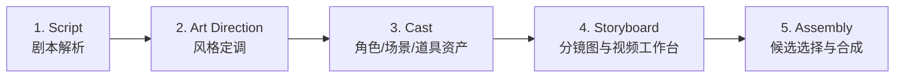
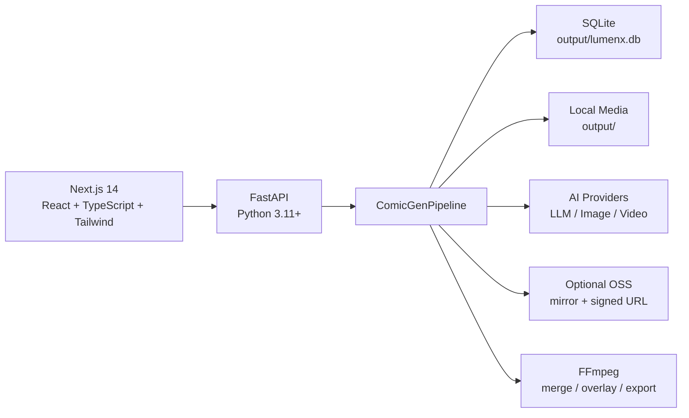

<div align="center">
  
</div>

<div align="center">

# LumenX Studio

AI 原生短漫剧与分镜视频生产工作台<br />
**Render Noise into Narrative**

[](LICENSE)
[](https://www.python.org/)
[](https://nodejs.org/)

[English](README_EN.md) | [用户手册](USER_MANUAL.md) | [贡献指南](CONTRIBUTING.md)

</div>

---

## 项目定位

LumenX Studio 是一个 local-first 的 AI 视觉叙事生产平台，用于把小说、剧本或分镜脚本转成可迭代的系列化视频工程。它覆盖从剧本解析、资产沉淀、分镜图生成、图生视频、候选管理到最终拼接的完整链路。

这个 fork 重点增强了系列资产复用、多资产参考生成、Seedance / Agnes / Kling / Vidu 等视频模型接入，以及面向短剧生产的 Storyboard R2V 工作台。

---

## 核心工作流



### 1. 剧本与实体

- LLM 自动提取角色、场景、道具
- 支持 Series 级共享资产和跨集复用
- 支持实体修正、出场关系和资产阶段管理

### 2. 风格定调

- 内置风格预设和 AI 智能推荐
- 项目级风格提示词统一注入后续图像/视频生成
- 支持紧凑化风格卡片，便于快速浏览和选择

### 3. 资产生成

- 角色、场景、道具图片生成与上传
- 支持 stage 资产演化：跨集阶段、锁定、候选图、选中图
- Cast 卡片会持续展示真实生成状态，直到图片产物可用

### 4. Storyboard R2V 工作台

Storyboard 工作台拆成三个明确模式：

| Tab | 用途 | 关键规则 |
| --- | --- | --- |
| 首帧 I2V | 生成/上传一个完整首帧，再提交视频模型 | 用完整分镜图做视频输入 |
| 关键帧 R2V | 管理独立首帧和尾帧，再生成视频 | 首帧、尾帧各自有提示词和候选池 |
| 资产合成 | 用角色/场景/道具参考图先合成完整分镜图，再生成视频 | 多资产引用属于图片生成阶段 |

工作台支持：

- 自动解析 `[character:...]` / `[scene:...]` / `[prop:...]` 参考标签
- Series + Episode 资产池合并
- 参考图到提示词的自然语言绑定
- `storyboard_image_prompt`：首帧 I2V / 资产合成专用分镜图提示词
- `keyframe_start_prompt` / `keyframe_end_prompt`：关键帧 R2V 独立提示词
- 分镜图、首帧、尾帧统一的预览 / 上传 / 重新生成 / 候选池交互
- POV 主观视角保护：参考角色图可作为身份/局部线索，但不会被强制第三人称出镜

### 5. 视频输出与日志

- 支持 Agnes、Seedance、Kling、Vidu、Wan、PixVerse 等视频模型
- Seedance 可作为视频输出模型，但多资产身份绑定应先由图片模型合成完整分镜图
- 请求日志面板是当前任务可见性的主入口，旧 Queue 面板已移除
- 支持视频候选、重试、标星、标签、上传已有视频和最终选择

---

## 模型与 Provider

LumenX 支持多种 provider 路径，并尽量把兼容逻辑放在后端 adapter 中，而不是散落在 UI 里。

| 类型 | 示例 | 说明 |
| --- | --- | --- |
| LLM | DashScope、OpenAI-compatible、Ollama | 剧本解析、提示词润色、实体提取 |
| 图片 | Wanx、Agnes Image、GPT Image、OpenAI-compatible | 资产图、分镜图、首尾关键帧 |
| 视频 | Agnes、Seedance、Kling、Vidu、Wan、PixVerse | I2V / R2V / keyframe video |
| 存储 | Local output、可选 OSS | 本地优先，OSS 只作为镜像和签名 URL 服务 |

Seedance 和 GPT Image 的兼容注意：

- 官方 Seedance 通道应保持官方请求格式，不要因为中转站差异污染官方 adapter。
- Relay / 中转站差异应在独立 provider adapter 中兼容。
- GPT Image 的 `/v1/images/edits` 与 `/v1/images/generations + extra_body.image` 差异也应封装在图片 provider 层。

---

## 系统架构



主要目录：

```text
lumenx/
├── frontend/                 # Next.js 前端
├── src/apps/comic_gen/       # 剧本、系列、资产、分镜、任务编排
├── src/models/               # 图像、视频、LLM provider adapter
├── src/utils/                # SQLite、存储、provider registry 等
├── config/model_catalog/     # 模型 catalog 源文件与生成产物
├── docs/                     # 模型接入与设计文档
├── tests/                    # 后端回归测试
├── output/                   # 本地数据库与生成媒体，运行时产生
└── logs/                     # 后端运行日志
```

---

## 快速开始

### 环境要求

- Python 3.11+
- Node.js 18+
- FFmpeg

### 安装依赖

```bash
pip install -r requirements.txt
npm install
cd frontend && npm install
```

### 配置 API Key

```bash
cp .env.example .env
```

最小可用配置通常是：

```env
DASHSCOPE_API_KEY=...
```

也可以在应用设置页配置 OpenAI-compatible、Seedance、Agnes、Kling、Vidu、ComfyUI、OSS 等 provider。

### 启动开发环境

项目根目录：

```bash
npm run dev
```

默认地址：

- 前端：http://localhost:3008
- 后端：http://localhost:17177
- API 文档：http://localhost:17177/docs

也可以分别启动：

```bash
./start_backend.sh
cd frontend && npm run dev
```

---

## 开发约定

重要约定详见 [AGENTS.md](AGENTS.md)，尤其是：

- 新 FastAPI endpoint 默认使用 `def`，不要在阻塞 I/O 中使用 `async def`
- API 响应使用 `signed_response(data)`
- 后端 Pydantic 字段变更时同步 `frontend/src/store/projectStore.ts`
- Storyboard R2V 参考图逻辑统一走 `frontend/src/components/modules/storyboard-r2v/assetReferences.ts`
- 资产引用应先用于图片合成完整分镜图，再把完整图交给视频模型

常用检查：

```bash
cd frontend && npm run typecheck
python -m py_compile src/apps/comic_gen/models.py src/apps/comic_gen/api.py src/apps/comic_gen/pipeline.py
python -m pytest
```

模型 catalog 变更后：

```bash
python scripts/build_model_catalog.py
python scripts/validate_model_catalog.py
```

---

## 文档

- [AGENTS.md](AGENTS.md) - 代码代理上下文与工程约定
- [用户手册](USER_MANUAL.md)
- [贡献指南](CONTRIBUTING.md)
- [模型接入实现说明](docs/model-onboarding-implementation.md)
- [Seedance 2.0 接入文档](docs/api-reference/volcengine-seedance-2.0-video.md)

---

## 许可证与致谢

本项目基于 [MIT License](LICENSE) 开源。

本仓库基于 [Alibaba LumenX](https://github.com/alibaba/lumenx) 二次开发，并在 Series 工作流、模型接入、本地优先存储、R2V 生产链路等方向持续扩展。

维护者：Wizard-J
